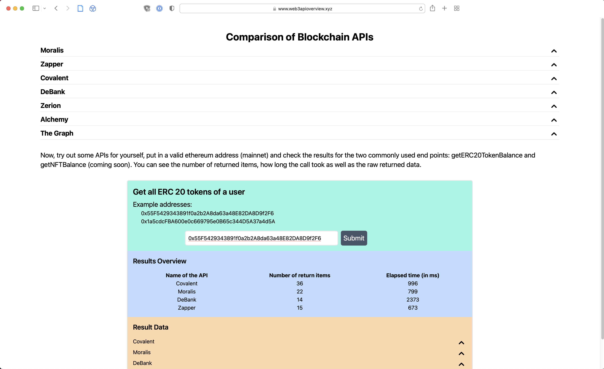

Live website: [web3apioverview](https://www.web3apioverview.xyz)

## What is the repo about?

While working on our green wallet [Pangea](http://www.trypangea.com/) we tried different web3 APIs to fetch user data. It was a painful process to set everything up so we though it's helpful for the community to open source our work.

We have added a little frontend with a simple getERC20Balance call to quickly see differences between APIs which you can see below:

## What's included so far?

-   Zapper
-   Covalent
-   Moralis
-   DeBank
-   Zerion (doesn't work on website since api key only works locally)

## Which APIs will be included next?

-   The Graph
-   Alchemy

## Ideas for more detailed comparisons

-   Compare how quickly an API adapts to changes after a new block is mined
-   Compare cross chain capabilities

## Want to contribute?

If you want to contribute, please raise an issue with a feature you want to add yourself or would like to have added or send me a message on twitter [@jan_ruettinger](http://twitter.com/jan_ruettinger).
